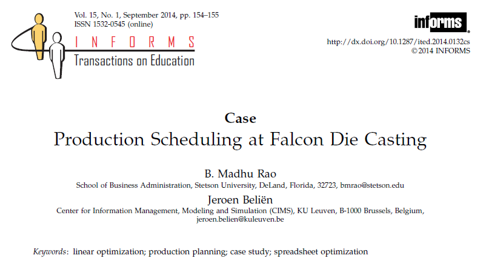

# Production-Scheduling-Falcon-Die-Casting-Case-Study
- Falcon Die Casting is a hypothetical industry wanting to carry out scheduling in a systematic manner with some assurance that the final schedule assigns production of parts to machines in an optimal manner.

- Since production employees are paid time & half for overtime work, our objective is on meeting the demand for the five parts with the least amount of overtime.

#

# Case Study: Problem Statement Information

